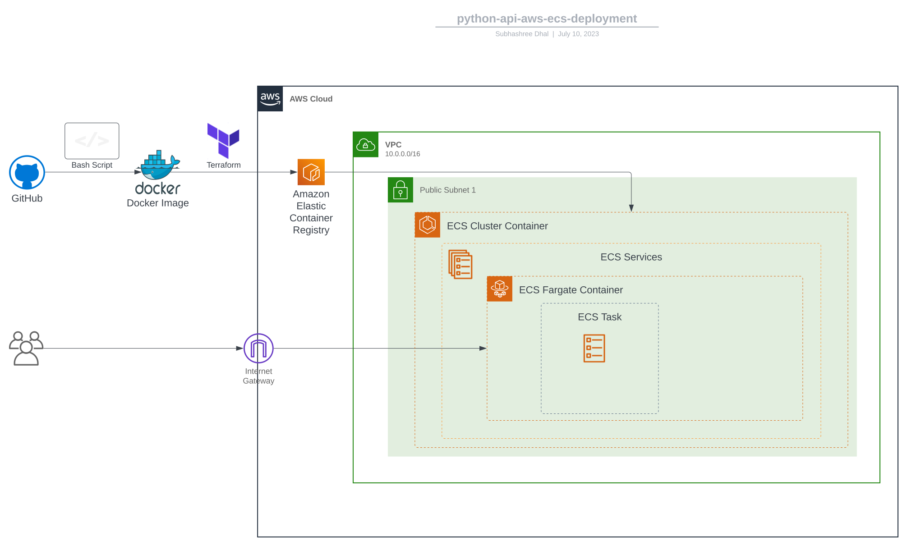

# python-api deployment to AWS ECS
Infrastructure deployment for python-api web application to AWS ECS using Terraform. Also automates building of docker image and pushing to ECR.

## Dependency 
* Docker
* [AWS CLI - V2](https://aws.amazon.com/cli/)
* [Terraform CLI](https://developer.hashicorp.com/terraform/cli)

## Build docker container and push to AWS-ECR

Export following ENV to configure AWS - 

```bash
export AWS_ACCESS_KEY_ID=*****************
export AWS_SECRET_ACCESS_KEY=*****************
export AWS_DEFAULT_REGION=*****************
export AWS_ACCOUNT_ID=***************** # to be used in ECR image path
```

Clone this python-api repo to build the docker image for the web application

```bash
git clone https://github.com/subhdhal/python-api-deployment
cd python-api-infra-deploy
./docker-build-push.sh | tee docker-build-push.log
```

## Deploy the application to AWS-ECS 

Deploy the application using the docker image we build above 

Get the ECR docker image URI we just build

```bash
export AWS_ECR_DOCKER_IMAGE_URI=$(cat docker-build-push.log | grep -oP '(?<=repositoryUri": ").*?(?=")')
```

Run the terrafrom scripts with above `AWS_ECR_DOCKER_IMAGE_URI`

```bash
terraform init
terraform plan -var 'AWS_ECR_DOCKER_IMAGE_URI='"$AWS_ECR_DOCKER_IMAGE_URI"
terraform apply -var 'AWS_ECR_DOCKER_IMAGE_URI='"$AWS_ECR_DOCKER_IMAGE_URI" -auto-approve
```

## Outline of the Deployment

